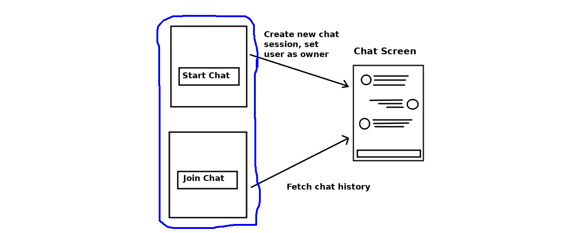
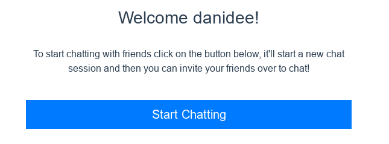
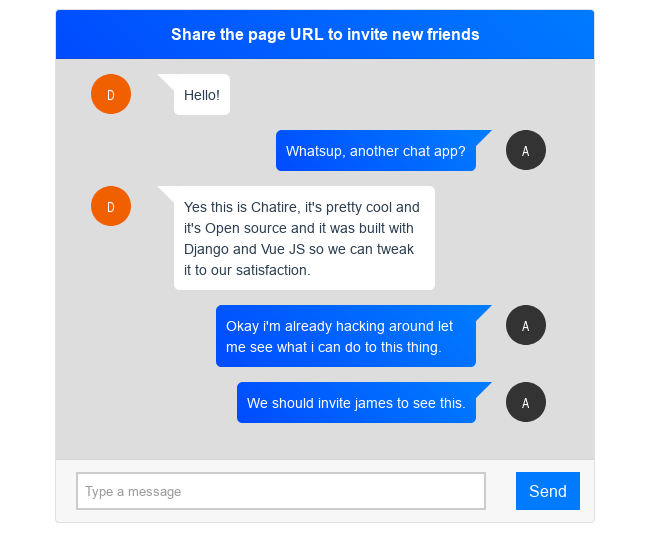
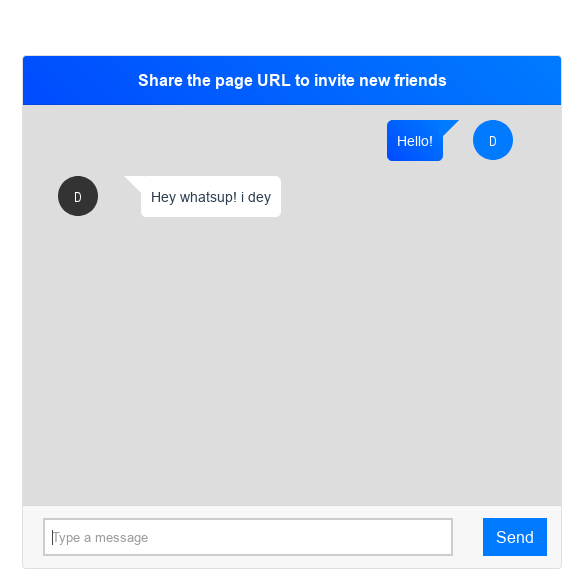

Realtime Django Part 4: Build a Chat application with django, RabbitMQ and Vue.js (Plug the Vue frontend into the django API)
---

- [1. UI/UX of the Chat Screen](#1-uiux-of-the-chat-screen)
- [2. Implementation](#2-implementation)
- [3. Starting a new session](#3-starting-a-new-session)
- [4. Sending messages](#4-sending-messages)
- [5. Joining a session](#5-joining-a-session)
- [6. REALTIME MESSAGING](#6-realtime-messaging)
- [7. Let’s do a little maths:](#7-lets-do-a-little-maths)

In part 3, we saw how we could Leverage django rest framework to build an API for our chat app, In this part we’re going to build the Chat UI and connect it to the API we built earlier. At the end of the part we should have a complete chat application with a URL that we can share to friends we want to chat with.

If that excites you buckle up, shift into high gear and let’s go!

# 1. UI/UX of the Chat Screen

Slow down a little! Before you depart at light speed, let’s have a little discussion on the UI/UX of the Chat screen.



First, the user should click on a button “Start Chatting”, on the backend, that’ll create a new chat session with the user as the owner, after that, they’ll be redirected (We’ll just change the URL and show the chat interface) to the chat interface where they chat with other users and invite others by sharing the chat link with them.

The blue squiglly line was drawn around the “Start Chat” and “Join Chat” screens to show that they’ll be handled by one Vue component. Also, the “Join Chat” isn’t actually a screen on it’s own. It’s a behaviour, once the open’s the URL of a valid chat session they’ll be automatically presented with a chat window with previous messages displayed so they can catch up.

# 2. Implementation

I’ve gone ahead to design the Chat interface in the Chat.vue component using bootstrap.

```html
<template>
  <div class="container">
    <div class="row">
      <div class="col-sm-6 offset-3">

        <div v-if="sessionStarted" id="chat-container" class="card">
          <div class="card-header text-white text-center font-weight-bold subtle-blue-gradient">
            Share the page URL to invite new friends
          </div>

          <div class="card-body">
            <div class="container chat-body">
              <div class="row chat-section">
                <div class="col-sm-2">
                  
                </div>
                <div class="col-sm-7">
                  <span class="card-text speech-bubble speech-bubble-peer">Hello!</span>
                </div>
              </div>
              <div class="row chat-section">
                <div class="col-sm-7 offset-3">
                  <span class="card-text speech-bubble speech-bubble-user float-right text-white subtle-blue-gradient">
                    Whatsup, another chat app?
                  </span>
                </div>
                <div class="col-sm-2">
                  
                </div>
              </div>
              <div class="row chat-section">
                <div class="col-sm-2">
                  
                </div>
                <div class="col-sm-7">
                  <p class="card-text speech-bubble speech-bubble-peer">
                    Yes this is Chatire, it's pretty cool and it's Open source
                    and it was built with Django and Vue JS so we can tweak it to our satisfaction.
                  </p>
                </div>
              </div>
              <div class="row chat-section">
                <div class="col-sm-7 offset-3">
                  <p class="card-text speech-bubble speech-bubble-user float-right text-white subtle-blue-gradient">
                    Okay i'm already hacking around let me see what i can do to this thing.
                  </p>
                </div>
                <div class="col-sm-2">
                  
                </div>
              </div>
              <div class="row chat-section">
                <div class="col-sm-7 offset-3">
                  <p class="card-text speech-bubble speech-bubble-user float-right text-white subtle-blue-gradient">
                    We should invite james to see this.
                  </p>
                </div>
                <div class="col-sm-2">
                  
                </div>
              </div>
            </div>
          </div>

          <div class="card-footer text-muted">
            <form>
              <div class="row">
                <div class="col-sm-10">
                  <input type="text" placeholder="Type a message" />
                </div>
                <div class="col-sm-2">
                  <button class="btn btn-primary">Send</button>
                </div>
              </div>
            </form>
          </div>
        </div>

        <div v-else>
          <h3 class="text-center">Welcome !</h3>

          <br />

          <p class="text-center">
            To start chatting with friends click on the button below, it'll start a new chat session
            and then you can invite your friends over to chat!
          </p>

          <br />

          <button @click="startChatSession" class="btn btn-primary btn-lg btn-block">Start Chatting</button>
        </div>

      </div>
    </div>
  </div>
</template>

<script>
const $ = window.jQuery

export default {
  data () {
    return {
      sessionStarted: false
    }
  },

  created () {
    this.username = sessionStorage.getItem('username')
  },

  methods: {
    startChatSession () {
      this.sessionStarted = true
      this.$router.push('/chats/chat_url/')
    }
  }
}
</script>

<!-- Add "scoped" attribute to limit CSS to this component only -->
<style scoped>
h1,
h2 {
  font-weight: normal;
}
ul {
  list-style-type: none;
  padding: 0;
}
li {
  display: inline-block;
  margin: 0 10px;
}

.btn {
  border-radius: 0 !important;
}

.card-footer input[type="text"] {
  background-color: #ffffff;
  color: #444444;
  padding: 7px;
  font-size: 13px;
  border: 2px solid #cccccc;
  width: 100%;
  height: 38px;
}

.card-header a {
  text-decoration: underline;
}

.card-body {
  background-color: #ddd;
}

.chat-body {
  margin-top: -15px;
  margin-bottom: -5px;
  height: 380px;
  overflow-y: auto;
}

.speech-bubble {
  display: inline-block;
  position: relative;
  border-radius: 0.4em;
  padding: 10px;
  background-color: #fff;
  font-size: 14px;
}

.subtle-blue-gradient {
  background: linear-gradient(45deg,#004bff, #007bff);
}

.speech-bubble-user:after {
  content: "";
  position: absolute;
  right: 4px;
  top: 10px;
  width: 0;
  height: 0;
  border: 20px solid transparent;
  border-left-color: #007bff;
  border-right: 0;
  border-top: 0;
  margin-top: -10px;
  margin-right: -20px;
}

.speech-bubble-peer:after {
  content: "";
  position: absolute;
  left: 3px;
  top: 10px;
  width: 0;
  height: 0;
  border: 20px solid transparent;
  border-right-color: #ffffff;
  border-top: 0;
  border-left: 0;
  margin-top: -10px;
  margin-left: -20px;
}

.chat-section:first-child {
  margin-top: 10px;
}

.chat-section {
  margin-top: 15px;
}

.send-section {
  margin-bottom: -20px;
  padding-bottom: 10px;
}
</style>
```

Note that @click being a short form for v-on:click

It’s pretty bulky (Over 200 lines of code) thanks to HTML/CSS and the dummy chat. Sadly this tutorial won’t cover much about design so the only thing of interest to us is the JavaScript in this component. But pay attention to the markup of the dummy chat because it would be useful to us to distinguish a user’s messages other messages

We created a property called sessionStarted this property allow us determine if a chat session is active or not. if a chat session is active, we’ll render the chat box else we’ll show the “Start chatting” view.

In the created hook we retrieve the username from the sessionStorage and stored it as a property of our component.

You may ask yourself why we did not make it part of the components data. We didn’t because the username property is not reactive. We don’t need the UI to react/respond to changes in it’s value.

As far as we are concerned, the username is never going to change once the user is logged in (It’ll be weird if it did).

You should only store properties that are reactive in a Component’s data. Vue won’t watch any attribute that’s added outside the data function.

This is how the chat component looks like:



If you “Start chatting” button it should change the URL and present a blank page. A blank page is shown because no routes match the url /chats/chat_url. Thankfully Vue router allows us dynamically match and capture parameters from a URL.

Go back to the router’s index.js file and change the Chat route to:

```js
{
    path: '/chats/:uri?',
    name: 'Chat',
    component: Chat
},
```

The question mark at the end tells vue router that the uri parameter is optional so it would match a bare `/chats`, `/chats/chat_url` even `/chats/abazaba`. Anything after the slash would be matched.

We can also get the uri in the component by accessing:

`this.$route.params` which returns an object: Object `{ uri: "chat_url" }`. We’ll need it soon.

Reload the page and you should see the Chat screen displayed



# 3. Starting a new session

To Start a new session, we’ll simply post to the API endpoint we created in Part 3

```js
created () {
  this.username = sessionStorage.getItem('username')

  // Setup headers for all requests
  $.ajaxSetup({
    beforeSend: function(xhr) {
      xhr.setRequestHeader('Authorization', `JWT ${sessionStorage.getItem('authToken')}`)
    }
  })
},

methods: {
  startChatSession () {
      $.post('http://localhost:8000/api/chats/', (data) => {
        alert("A new session has been created you'll be redirected automatically")
        this.sessionStarted = true
        this.$router.push(`/chats/${data.uri}/`)
      })

      .fail((response) => {
        alert(response.responseText)
      })
    }
}
```

In the created hook we setup the Authorization headers for all Ajax requests. Without that, the request would fail because we would be trying to post as an unauthenticated user.

# 4. Sending messages

So how do we send messages?

You got it. By posting the messages endpoint. Before we do that let’s get rid of the dummy messages and store the messages in the component’s data as an Array.

This is the Chat component (without the CSS)

```html
<template>
  <div class="container">
    <div class="row">
      <div class="col-sm-6 offset-3">

        <div v-if="sessionStarted" id="chat-container" class="card">
          <div class="card-header text-white text-center font-weight-bold subtle-blue-gradient">
            Share the page URL to invite new friends
          </div>

          <div class="card-body">
            <div class="container chat-body">
              <div v-for="message in messages" :key="message.id" class="row chat-section">
                <template v-if="username === message.user.username">
                  <div class="col-sm-7 offset-3">
                    <span class="card-text speech-bubble speech-bubble-user float-right text-white subtle-blue-gradient">
                      {{ message.message }}
                    </span>
                  </div>
                  <div class="col-sm-2">
                    
                  </div>
                </template>
                <template v-else>
                  <div class="col-sm-2">
                    
                  </div>
                  <div class="col-sm-7">
                    <span class="card-text speech-bubble speech-bubble-peer">
                      {{ message.message }}
                    </span>
                  </div>
                </template>
              </div>
            </div>
          </div>

          <div class="card-footer text-muted">
            <form>
              <div class="row">
                <div class="col-sm-10">
                  <input type="text" placeholder="Type a message" />
                </div>
                <div class="col-sm-2">
                  <button class="btn btn-primary">Send</button>
                </div>
              </div>
            </form>
          </div>
        </div>

        <div v-else>
          <h3 class="text-center">Welcome !</h3>
          <br />
          <p class="text-center">
            To start chatting with friends click on the button below, it'll start a new chat session
            and then you can invite your friends over to chat!
          </p>
          <br />
          <button @click="startChatSession" class="btn btn-primary btn-lg btn-block">Start Chatting</button>
        </div>
      </div>
    </div>
  </div>
</template>

<script>

const $ = window.jQuery

export default {
  data () {
    return {
      sessionStarted: false,
      messages: [
        {"status":"SUCCESS","uri":"040213b14a02451","message":"Hello!","user":{"id":1,"username":"danidee","email":"osaetindaniel@gmail.com","first_name":"","last_name":""}},
        {"status":"SUCCESS","uri":"040213b14a02451","message":"Hey whatsup! i dey","user":{"id":2,"username":"daniel","email":"","first_name":"","last_name":""}}
      ]
    }
  },

  created () {
    this.username = sessionStorage.getItem('username')

    // Setup headers for all requests
    $.ajaxSetup({
      beforeSend: function(xhr) {
        xhr.setRequestHeader('Authorization', `JWT ${sessionStorage.getItem('authToken')}`)
      }
    })
  },

  methods: {
    startChatSession () {
      $.post('http://localhost:8000/api/chats/', (data) => {
        alert("A new session has been created you'll be redirected automatically")
        this.sessionStarted = true
        this.$router.push(`/chats/${data.uri}/`)
      })
      .fail((response) => {
        alert(response.responseText)
      })
    }
  }
}
</script>
```

The chat screen should look like this now:



We used a v-if directive to compare the message sender with the currently logged in user. Based on the the result, we can determine how the message should be displayed.

Messages sent by the user are aligned to the right with a blue background while those sent by other users are aligned to the left with a white background.

With all we’ve done, It’s pretty obvious how we should handle messages. When we post a new message, we just need to add it to the messages list and Vue will take care of the UI sweet!

```js
<script>

const $ = window.jQuery

export default {
  data () {
    return {
      sessionStarted: false, messages: [], message: ''
    }
  },

  created () {
    ...
  },

  methods: {
    ...

    postMessage (event) {
      const data = {message: this.message}

      $.post(`http://localhost:8000/api/chats/${this.$route.params.uri}/messages/`, data, (data) => {
        this.messages.push(data)
        this.message = '' // clear the message after sending
      })
      .fail((response) => {
        alert(response.responseText)
      })
    }
  }
}
</script>
```

We’ve added another property message to our data object, we’ll use this to keep track of the text that’s typed into the input field.

Let’s tells Vue about it in our template:

```html
<form @submit.prevent="postMessage">
  <div class="row">
    <div class="col-sm-10">
      <input v-model="message" type="text" placeholder="Type a message" />
    </div>
    <div class="col-sm-2">
      <button class="btn btn-primary">Send</button>
    </div>
  </div>
</form>
```

`@submit.prevent` is a short form for v-on:submit.prevent the .prevent modifier prevents the default action of the form from occuring (i.e the form won’t be submitted). This is another reason why i love Vue.js. It’s sprinkled with simple helpers and just the right amount of magic.

You’re free to call event.preventDefault in the postMessage method but that’s not “Vue-like”.

If everything went well, We should be able to send messages and have them show in the chat UI Awesome!

# 5. Joining a session

We can finally send messages but the chat is going to be pretty boring because we’re just talking to ourselves. How can we invite our friends to join us?

We also have another problem, hit refresh in your browser and boom! we’re redirected back to the “Start Chatting” page. Neither The owner of the chat session nor their friends can join or resume a chat session.

To Fix that, we need to send a PATCH request to /api/chats/ and if we can find the user in the result returned from the server that means they were succesfully added to the chat session (or they were already memebers). Then we can fetch the chat history and display it to them.

```html
<script>
const $ = window.jQuery

export default {
  data () {
    return {
      sessionStarted: false, messages: [], message: ''
    }
  },

  created () {
    this.username = sessionStorage.getItem('username')

    // Setup headers for all requests
    $.ajaxSetup({
      beforeSend: function(xhr) {
        xhr.setRequestHeader('Authorization', `JWT ${sessionStorage.getItem('authToken')}`)
      }
    })

    if (this.$route.params.uri) {
      this.joinChatSession()
    }
  },

  methods: {
    startChatSession () {
      ...
    },

    postMessage (event) {
      ...
    },

    joinChatSession () {
      const uri = this.$route.params.uri

      $.ajax({
        url: `http://localhost:8000/api/chats/${uri}/`,
        data: {username: this.username},
        type: 'PATCH',
        success: (data) => {
          const user = data.members.find((member) => member.username === this.username)

          if (user) {
            // The user belongs/has joined the session
            this.sessionStarted = true
            this.fetchChatSessionHistory()
          }
        }
      })
    },

    fetchChatSessionHistory () {
      $.get(`http://127.0.0.1:8000/api/chats/${this.$route.params.uri}/messages/`, (data) => {
        this.messages = data.messages
      })
    }
  }
}
</script>
```

Now Refresh the browser and you should be able to resume the chat and see your chat history.

Also open another tab, login and navigate to the chat URL. If everything went well you should have the chat history forwarded to you. which means other users can join a chat session.

# 6. REALTIME MESSAGING

Right now our chat application sucks because the user has to manually hit the refresh button to check for new messages. Ideally we want this process to be automatic.

The solution is already at your fingertips

- You have a method that fetches all messages from the server.
- You have the setInterval function.
- You have JavaScript.


You got this

```js
created () {
  this.username = sessionStorage.getItem('username')

  // Setup headers for all requests
  $.ajaxSetup({
    beforeSend: function(xhr) {
      xhr.setRequestHeader('Authorization', `JWT ${sessionStorage.getItem('authToken')}`)
    }
  })

  if (this.$route.params.uri) {
    this.joinChatSession()
  }

  setInterval(this.fetchChatSessionHistory, 3000)
},
```

Well that was pretty simple, we just needed to add one line to our created hook.

`setInterval(this.fetchChatSessionHistory, 3000)`

which retrieves the Chat history every 3 seconds and gives the end user the illusion of Realtime messaging.

You’ve just implemented polling. For small applications this is fine. but if your application has a large userbase, polling can be horribly inefficient. You’ll see why.

# 7. Let’s do a little maths:

For two users in a session (Suppose they login at the same time). In 3 seconds, they’ll make 2 requests. In a minute, they’ll make 40 requests. In one hour that’s 2400 requests. For just 2 users!. For 100 users active for one hour we’ll have 240,000 requests!

A decent server should be able to handle 240k requests per hour easily but the main problem here is the needless polling and unnecessary work the server has to do. (Remember each request triggers a database SELECT too).

In the long run, this would easily hurt our servers and the worst part is even when users are idle their browsers will keep on making requests whether there’s a new message or not. We can monitor when they’re idle by tracking the last time they typed and then calling clearInterval to stop polling the url but even with that, we would still have unnecessary requests since we can’t predict the exact moment that a user goes idle. They can stop typing while waiting for other users to reply it doesn’t mean they’re not interested in receiving new messages.

Also bandwidth-wise each request wastes bandwidth because they contains headers, `cookies and authentication information that we don’t really need, we’re only interested in messages.

There has to be a more efficient way of handling this.

That’s the exact problem WebSockets solve by opening a persistent bi-directional connection between the server and the client which means the client never needs to ask the server for new information. When it’s available, the server simply pushes it to the client.

Also, if the client needs to send information to the server, it can make use of the same connection.

WebSockets are more efficient than polling and in the next part, i’ll show you how you can integrate it (using uWSGI) with the chat application without really changing much of our current code.